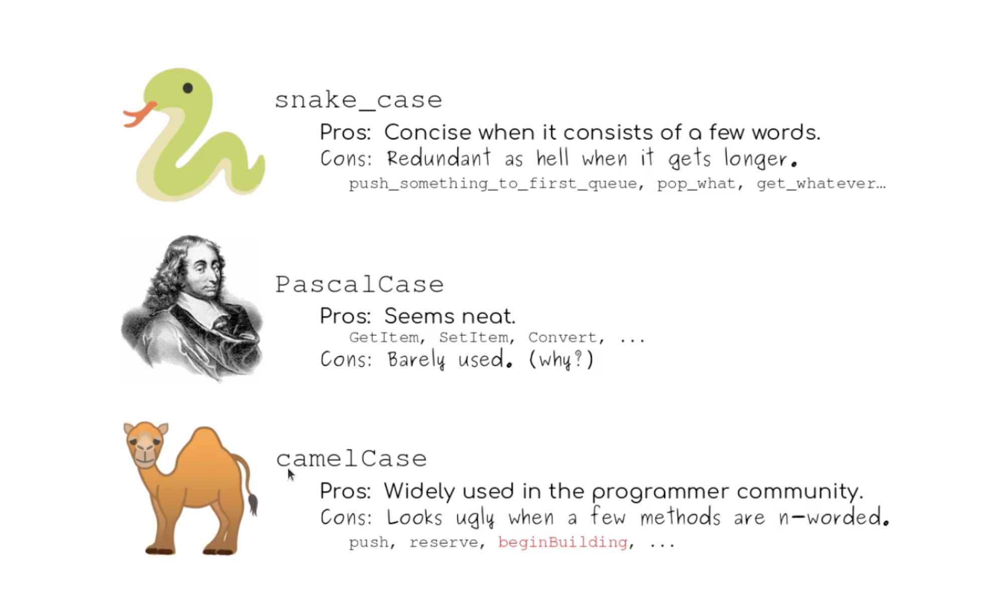

# Rodando o Projeto

```
expo start
```

## Export Defaul
Quando usar o export default, deve ser importado sem chaves, pois ele é o único a ser exportado, o nome da função deve ser mantido como declado no componente.

## Direction Default
O React Naive vem de padrão com o flexDirection: column, ou seja, os elementos são exibidos um abaixo do outro. Você pode estilizar o flexDirection: row para exibir os elementos um ao lado do outro.

# Typescript

Usando Typescript no React Native.

## Componente ScrollView e FlatList

- O *ScrollView* é um componente que permite que o usuário deslize para ver o conteúdo que não está visível na tela. O *ScrollView* renderiza todos os seus componentes filhos de reação de uma só vez, mas isso tem uma desvantagem de desempenho.

- *FlatList* é um componente que renderiza uma lista de elementos de forma otimizada, removendo os itens que rolam para fora da tela para economizar memória e tempo de processamento.

# Hooks
- Permite que você use o estado e outras funcionalidades do React sem escrever uma classe.
- Encapsula funcionalidade e facilita o reaproveitamento da sua lógica.

*useState* - Permite que você adicione o estado ao seu componente de função.
*useEffect* - Permite que você execute efeitos colaterais em seus componentes de função.

- Os nomes dos Hooks começam com *"use"* e usam camelCase.
Algumas classe de escrita:
